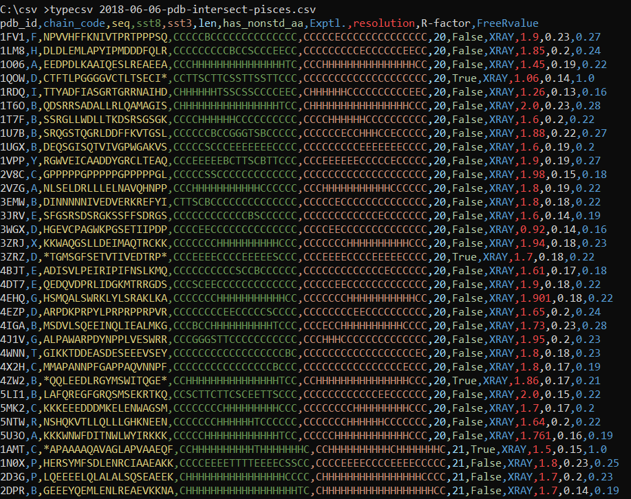

# TypeCsv

Windows console program to displays a CSV with each column in a different color.
```
    typecsv <filepath>
```
Displays the file specified in filepath. If no file is specified then input is read from the console. This allows you to pipe the output of other commands into this command.

Example
```
    type log.csv | typecsv
```
Here is an example of the output:



The example data is from the [Protein Secondary Structure](https://www.kaggle.com/alfrandom/protein-secondary-structure) public database on [Kaggle](https://www.kaggle.com/). 

The colors are based on the [Rainbow CSV VSCode Extension](https://marketplace.visualstudio.com/items?itemName=mechatroner.rainbow-csv).

## Other File Formats

This tool also displays other delimited file formats with colors for each column. The file extensions is used to determine the file type. The following file formats are supported:

| Extension | File Type              |
|:---------:| ---------------------- |
|    csv    | Comma Separated Values |
|    tab    | Tab delimited file     |
|    tsv    | Tab delimited file     |

If the file has none of these types or the text is being read from standard input then the number of commas, tabs and pipes in the first line is used to determine the file type.

You can also specify which file format should be used using command line arguments as follows:

| Argument | File Type               |
|:--------:| ----------------------- |
|   /csv   | Comma Separated Values  |
|   /tab   | Tab Delimited File      |
|   /pipe  | Pipe ( \| ) Delimited File |

For example to specify that a file with a log extension should be treated as a tab delimited file you can do this:

```
    typecsv ex20191014.log | typecsv /tab
```

You can also specify any delimiter you want using the /token argument. For example to split the out out of the findstr command using semicolons you could type:

```
    findstr error *.log | typecsv /token ;
```

## Download

You can down the latest version of the TypeCsv.exe program from [releases](https://gitlab.com/patleahy/TypeCsv/-/releases).
